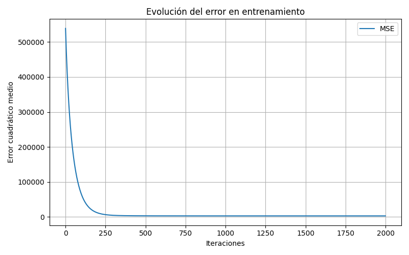
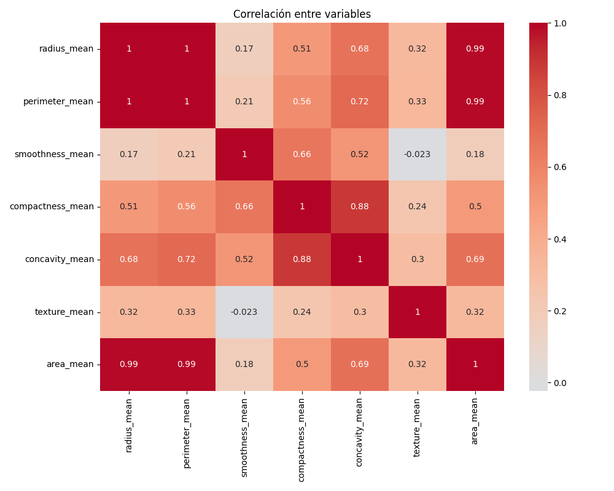
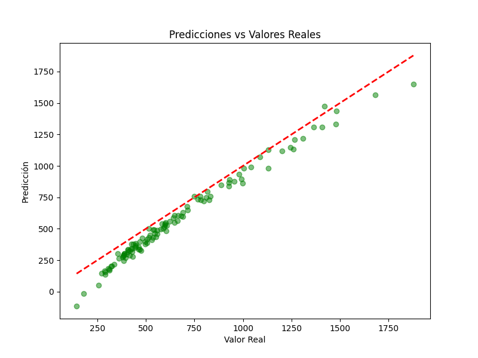
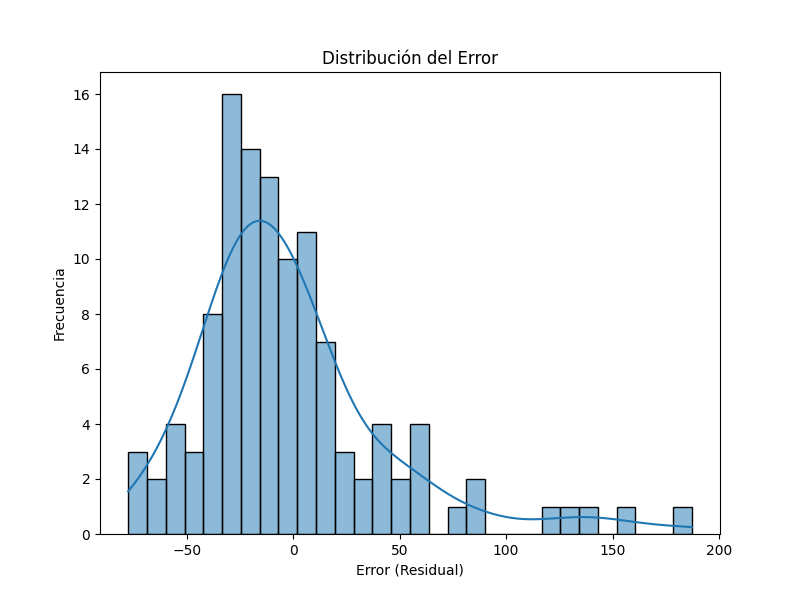

# Cancer_Regression_Analysis

Implementación manual de un algoritmo de regresión lineal sin el uso de frameworks de machine learning.  

## Descripción del dataset

El dataset contiene información de características celulares obtenidas a partir de imágenes de tumores, con el objetivo de predecir el tamaño del área media del tumor (`area_mean`). El dataset está organizado de la siguiente manera:

| Variable                  | Descripción |
|----------------------------|-------------|
| `radius_mean`              | Radio promedio de las células |
| `perimeter_mean`           | Perímetro promedio de las células |
| `smoothness_mean`          | Suavidad promedio de las células |
| `compactness_mean`         | Compacidad promedio |
| `concavity_mean`           | Concavidad promedio |
| `texture_mean`             | Textura promedio |
| `area_mean`                | Área promedio de las células (variable objetivo) |

Fuente: [Breast Cancer Wisconsin (Diagnostic) Data Set](https://www.kaggle.com/datasets/uciml/breast-cancer-wisconsin-data)

---

## Objetivo

Predecir el tamaño del área media del tumor utilizando un modelo de regresión lineal implementado desde cero, evaluando el impacto de las características seleccionadas sobre la variable objetivo mediante **MSE** y **R²**.

---

## Procedimiento

### ETL y Preprocesamiento de Datos

1. **Carga de datos:** Se leyó el archivo CSV y se creó un DataFrame de pandas.  
2. **Análisis inicial:** Se exploraron valores nulos y tipos de datos; la columna `diagnosis` se eliminó para la predicción de `area_mean`.  
3. **Selección de variables:** Se eligieron las variables más representativas:  
   - `radius_mean`, `perimeter_mean`, `smoothness_mean`, `compactness_mean`, `concavity_mean`, `texture_mean`.  
4. **Normalización:** Variables escaladas con **Z-score** para mantener la misma escala y evitar dominancia en gradiente descendente.  
5. **División de datos:** 80% entrenamiento, 20% prueba.

---

### Implementación del Modelo

- Modelo de **regresión lineal desde cero**:  
  - Función hipótesis: \(y = X \cdot \theta + b\)  
  - Función de costo: **MSE**  
  - Gradiente descendente: actualización iterativa de \(\theta\) y b.  
- Registro de MSE por época para seguimiento de convergencia.

---

### Entrenamiento

- **Learning rate:** 0.01  
- **Épocas:** 2000  

---

### Evaluación

1. **Métricas obtenidas:**
   - MSE Entrenamiento: 2844.00  
   - MSE Prueba: 2081.69  
   - R² Entrenamiento: 0.9774  
   - R² Prueba: 0.9819

2. **Predicciones de ejemplo:**

| Real  | Predicho |
|-------|----------|
| 481.90 | 492.81  |
| 1130.00 | 1122.88 |
| 748.90 | 809.41  |
| 467.80 | 471.51  |
| 402.90 | 391.12  |

---

## Resultados gráficos

### Evolución del error durante el entrenamiento

### Correlación entre variables

### Predicciones vs valores reales

### Distribución de errores (residuals)

---

## Limitaciones

- Modelo captura solo relaciones lineales.  
- Variables seleccionadas manualmente, podría faltar información relevante.  
- Posible correlación entre características que afecta interpretación de pesos.  
- No se consideran interacciones no lineales.  
- Sensible a outliers.  
- Validación simple (entrenamiento/prueba), sin cross-validation.  
- Dataset relativamente pequeño.

---

## Conclusión

El modelo de regresión lineal implementado desde cero logró predecir correctamente el área media de los tumores con **R²>0.97**, indicando que explica la mayoría de la varianza.  
Permite comprender la influencia de cada característica y sirve de base para aprendizaje sobre implementación manual de algoritmos y gradiente descendente.  

Aunque los resultados son buenos, es importante validar en otros datasets y considerar la inclusión de más variables, regularización y modelos no lineales para mejorar precisión y generalización.

---

## Mejoras a futuro

- Implementar **regularización** (Ridge, Lasso) para reducir posible sobreajuste.  
- Validación cruzada para evaluar estabilidad del modelo.  
- Explorar **modelos no lineales** (regresión polinómica, árboles de decisión).  
- Automatizar selección de variables y reducir correlaciones problemáticas.  
- Crear **dashboard interactivo** para visualización de predicciones y errores.
